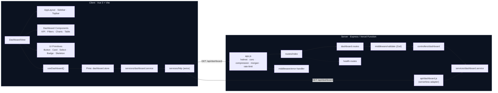

# MeshAnalytics Dashboard

A production-grade SaaS analytics dashboard that visualizes revenue, pipeline, channel performance, and account-level insights for go-to-market teams. Built as a clean monorepo with a Vue 3 client and an Express API designed for serverless deployment.

---

## Features

- **Revenue Performance dashboard** with KPI cards, line / bar / doughnut charts, and a top-accounts table
- **Live filters** for period, region, and segment, with optimistic loading and request cancellation
- **Reusable UI system**: design tokens, buttons, cards, selects, badges, skeletons, and icons
- **App shell layout** with sidebar navigation, topbar search, notifications slot, and refresh action
- **Robust loading & error states** (skeletons during fetch, retry on failure)
- **CSV export** of the top accounts table
- **Hardened API**: Helmet, CORS allowlist, gzip compression, rate limiting, query validation, structured error responses

## Tech Stack

- Vue 3
- Pinia
- Chart.js + vue-chartjs
- Axios
- Vite
- Node.js + Express
- Zod
- Helmet, CORS, compression, morgan, express-rate-limit


## Prerequisites

- Node.js **>= 18.18**
- npm **>= 9** (or pnpm / yarn)
- Git

## Setup

### 1. Clone and install

```bash
git clone <your-repo-url> meshanalytics-dashboard
cd meshanalytics-dashboard

cd server && npm install
cd ../client && npm install
```

### 2. Configure environment

```bash
cp client/.env.example client/.env.local
```

### 3. Run locally

In two terminals:

```bash
# Terminal 1 — API
cd server
npm run dev          # http://localhost:4000/api

# Terminal 2 — Web
cd client
npm run dev          # http://localhost:5173
```

### 4. Production build

```bash
cd client && npm run build && npm run preview
cd ../server && npm start
```

## Mermaid Diagram



## Goal

Demonstrate the engineering decisions behind a real SaaS product: a clean separation of UI, state, and data access on the client; a layered, validated, observable API on the server; a single source of truth for business logic shared between long-running and serverless runtimes; and a UI system that can grow into a full design library without rework.
